# 🚀 Text2SQL using Qwen3 + LoRA

> Fine-tuning **Qwen3-0.6B-Base** using **LoRA** to translate natural language questions into executable SQL queries.


---

## Overview

This project demonstrates an end-to-end **Text-to-SQL** system built using **Qwen3-0.6B-Base** and **LoRA (Low-Rank Adaptation)**.

The repository contains:

 - Training Pipeline
 - Inference Pipeline
 - Evaluation Pipeline
 - LoRA Adapter Saving
 - SQL Quality Metrics

---

# Architecture
                    ┌────────────────────┐
                    │ SQL Dataset        │
                    └─────────┬──────────┘
                              │
                              ▼
                    Prompt Construction
                              │
                              ▼
                 Qwen3-0.6B-Base + LoRA
                              │
                ┌─────────────┴─────────────┐
                │                           │
                ▼                           ▼
         Save Adapter                 Generate SQL
                                              │
                                              ▼
                                   Evaluation Pipeline

# Project Workflow

# Project Workflow




```mermaid
graph TD
    A([Natural Language Question]) --> Step1
    
    subgraph DataPrep ["src/data_utils.py"]
        Step1[Prompt Formatting]
    end

    subgraph Inference ["src/inference.py"]
        Step1 --> Step2[Fine-tuned Qwen3 Model]
        Step2 --> Step3[Generated SQL Query]
    end

    subgraph Eval ["src/evaluate.py & src/metrics.py"]
        Step3 --> Step4[Evaluation Metrics]
    end

    %% Theme Optimization
    style Step2 fill:#1f6feb,stroke:#fff,stroke-width:1px,color:#fff
    style DataPrep fill:#161b22,stroke:#30363d
    style Inference fill:#161b22,stroke:#30363d
    style Eval fill:#161b22,stroke:#30363d
```

# Training Pipeline
### Technical Workflow Map

```mermaid
graph TD
    subgraph DataPrep ["Data Preparation (src/data_utils.py)"]
        A[Dataset] --> B[Load Dataset]
        B --> C[Format Prompt]
        C --> D[Tokenization]
    end

    subgraph ModelTraining ["Model Setup & Training (src/train.py)"]
        D --> E[Load Base Qwen Model]
        E --> F[Apply LoRA Config]
        F --> G[Execute Fine-tuning]
        G --> H[Save Adapter to outputs/]
    end

    subgraph ModelEval ["Evaluation (src/evaluate.py & src/metrics.py)"]
        H --> I[Inference on Test Set]
        I --> J[Compute SQL Metrics]
        J --> K[Export Logs to outputs/]
    end

    %% Visual Anchors Styling
    style A fill:#238636,stroke:#fff,stroke-width:1px,color:#fff
    style H fill:#1f6feb,stroke:#fff,stroke-width:1px,color:#fff
    style K fill:#8957e5,stroke:#fff,stroke-width:1px,color:#fff
    style DataPrep fill:#161b22,stroke:#30363d
    style ModelTraining fill:#161b22,stroke:#30363d
    style ModelEval fill:#161b22,stroke:#30363d
```




# Evaluation Pipeline

                    Predicted SQL
                          │
                          ▼
             +-------------------------+
             | SQL Normalization       |
             +-------------------------+
                          │
          ┌───────────────┼────────────────┐
          ▼               ▼                ▼
     Exact Match      Valid SQL      Clause Match
                          │
                          ▼
             Synthetic Execution
                    Accuracy
                          │
                          ▼
              Evaluation Report (.csv)


# Repository Structure & Workflow

```text
text2sql-qwen-lora/
├── configs/
│   └── config.yaml          # Hyperparameters, LoRA configurations, and dataset paths
├── outputs/
│   ├── adapter/             # Final trained LoRA adapter weights & checkpoints
│   └── evaluation/          # Benchmark results, generated SQL, and test logs
├── src/
│   ├── data_utils.py        # Dataset loading ──> Prompt formatting ──> Tokenization
│   ├── train.py             # Load base model ──> Apply LoRA ──> Run Fine-tuning
│   ├── inference.py         # Loads saved adapter for interactive Text-to-SQL generation
│   ├── evaluate.py          # Main execution loop for testing model on holdout sets
│   └── metrics.py           # Computes Execution Accuracy and Exact Set Match scores
├── requirements.txt         # Python dependencies (peft, transformers, trl, bitsandbytes)
└── README.md                # Project documentation
```


# Model

| Component   | Value              |
| ----------- | ------------------ |
| Base Model  | Qwen3-0.6B-Base    |
| Fine-tuning | LoRA               |
| Dataset     | SQL Create Context |
| Framework   | Hugging Face       |
| GPU         | Google Colab T4    |


# Evaluation Results

| Metric                       | Score      |
| ---------------------------- | ---------- |
| Exact Match                  | **78.50%** |
| Valid SQL                    | **98.00%** |
| Synthetic Execution Accuracy | **93.50%** |
| Clause Match                 | **90.97%** |


# Example

Which department has the highest salary?

SELECT department
FROM employee
ORDER BY salary DESC
LIMIT 1;

# Installation
git clone https://github.com/yourname/text2sql-qwen-lora.git

cd text2sql-qwen-lora

pip install -r requirements.txt

# Training
python src/train.py --config configs/config.yaml

# Evaluation
python src/evaluate.py --config configs/config.yaml

# Inference
python src/inference.py --config configs/config.yaml

# Current Limitations
 - Trained on a subset (5,000 samples)
 - Synthetic execution evaluation (not official Spider execution)
 - Single-model support

# Future Improvements
 - Official Spider evaluation
 - FastAPI backend
 - Streamlit frontend
 - Docker support
 - TensorBoard logging
 - Hugging Face Spaces deployment

# Tech Stack
-Python
-PyTorch
-Hugging Face Transformers
-PEFT (LoRA)
-Hugging Face Datasets
-SQLite
-Google Colab
-YAML
